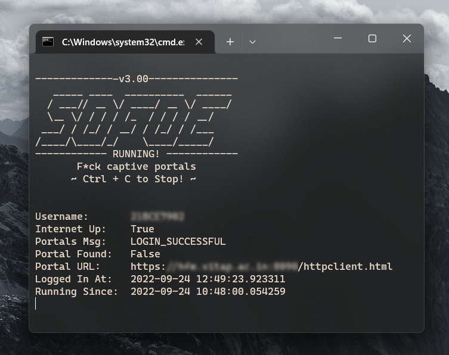

<div align="center">
  <a href="https://github.com/fullmeteor172/sofoe">
    
  </a>
  <h3 align="center">F*ck captive portals</h3>
  <p align="center">
    A Script to Automate VIT-AP's WiFi Login
    <br />
    <a href="https://github.com/fullmeteor172/sofoe/issues">Report Bug</a>
    ·
    <a href="https://github.com/fullmeteor172/sofoe/issues">Request Feature</a>
    <br />
  </p>
</div>

## About the project
<br />
<div align="center">
    
</div>
<br/>

Sofoe was born out of my passionate hatred for the Sophos login portal. I hated having to open it every time I wanted to connect to the internet, I hated that I had to keep that tab open for it to work, I hated how clunky to whole UX felt. Sofoe is my solution to it.

Running this script will keep you logged into the WiFi. If the Uni's WiFi goes down (which it does way too often) it'll attempt to log you back in as soon as it can. You can also temporarily pause this and logout too.

This will work in **ALL** the buildings on campus, the MH's, LH's and all Academic Blocks with seamless transition from one to the other

### Features
- [x] Keeps trying to auto-login
- [x] Internet can stay up even if the script is closed
- [x] Option to pause auto-login and logout
- [x] Shows servers responses in the CLI (Eg: `Login Successful`, `Max Devices` ...)
- [x] Logs events to make troubleshooting easy in `app.log`
- [x] Auto-detects URL for the Login Portal
- [x] Doesn't break if you connect to a different network
- [x] Light-Weight and Fast
- [x] Cross-Platform code
- [ ] Choice to pick between emulating a desktop or mobile client

## Is it Legal / Safe / Ok to run?
**Yes. 🗿**

It basically does what the WiFi login website does, just more naked and faster.
The source code is open for all to see, feel free to go through it if you're still worried!

## How do I run this?
1. Ensure that you have [python3](https://www.python.org/downloads/) installed
2. Clone or [Download](https://github.com/fullmeteor172/sofoe/archive/refs/heads/main.zip) the code of this repository
```
git clone https://github.com/fullmeteor172/sofoe.git
```
3. Install additional requirements by running
```
pip install -r requirements.txt
```
4. Set your username and password by opening the `credentials.json` file
```json
#👇Change username and password here
{
    "username":"Add it inside the quotes",
    "password":""
}
```
5. Run it! 🎊
```
py sofoe.py
```

5. Optional Step: Set it up to run on boot. (DIY based on your os)

## License
Distributed under the GNU AGPLv3. See `LICENSE.txt` for more information.

By Dhruv Jha
